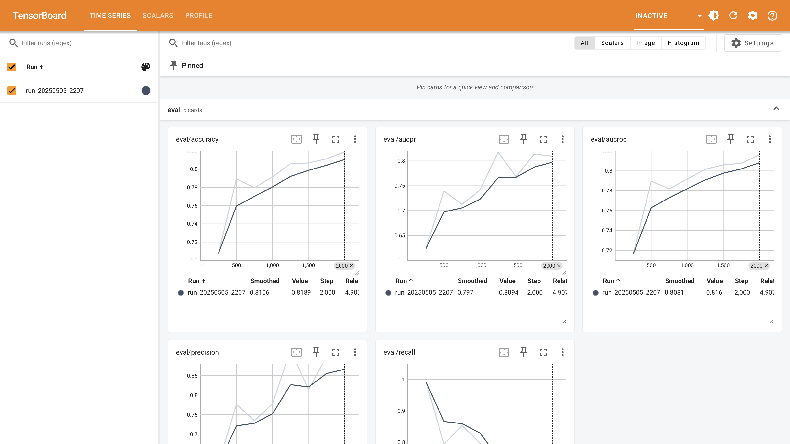

# JAX Starter Pack

An opinionated template for JAX projects. Out of the box it includes:

- Zero-plumbing configuration via [Fiddle](https://github.com/google/fiddle)
- Model definitions in [NNX](https://flax.readthedocs.io/en/v0.8.3/experimental/nnx/index.html)
- Summaries and Profiling via [TensorBoard](https://jax.readthedocs.io/en/latest/profiling.html#manual-capture-via-tensorboard)
- Checkpointing via [Orbax](https://orbax.readthedocs.io/)
- Data loading via [Grain](https://google-grain.readthedocs.io/)

## Basic Usage

Installation:

```sh
pip install -r requirements.txt
```

Run the trainer locally:

```sh
python train.py
```

Run TensorBoard for metrics visualization:

```sh
tensorboard --logdir=/tmp/tensorboard
```



## Overview

Here are the main components of the model:

```sh
├── config.py # Fiddle configurations
├── data.py # Datasets
├── model.py # Model definitions
└── train.py # Trainer binary
```

## Further Usage

Run a different example:

```sh
python train.py --config=config:text_classification
```
